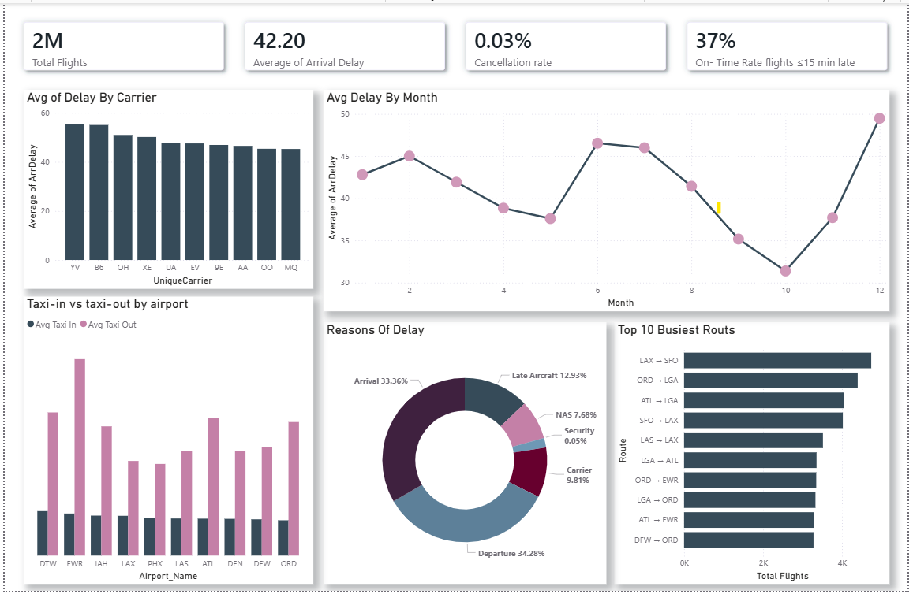
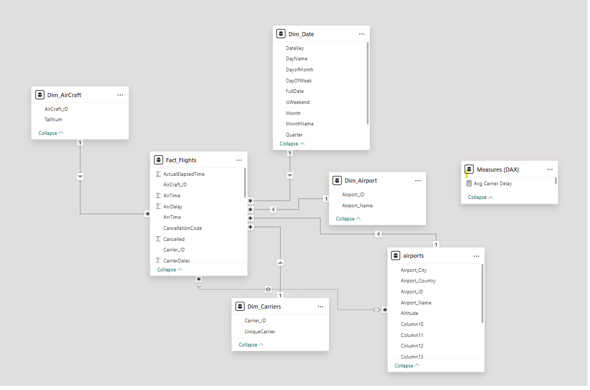
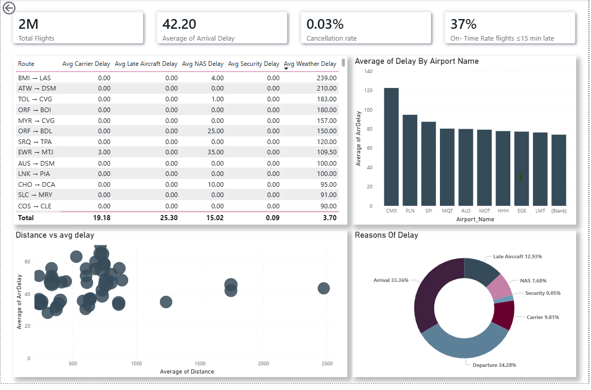

# ✈️ Flight Data Analytics Dashboard



## 📖 Project Overview

This project presents a complete **Business Intelligence solution** for analyzing U.S. domestic flight operations using millions of flight records.

The objective was to transform raw flight data into meaningful business insights through data modeling, ETL processes, DAX calculations, and interactive Power BI visualizations.

The final solution enables users to analyze airline performance, delay trends, airport efficiency, route traffic, and operational disruptions through an intuitive dashboard experience.

---

## 🎯 Business Objectives

The dashboard helps answer key business questions such as:

* Which airlines have the best and worst on-time performance?
* What are the primary causes of flight delays?
* Which airports experience the highest congestion?
* Which routes generate the most traffic?
* How do delays vary by season, month, and time of day?
* What operational factors impact customer experience?

---

## 🗂 Repository Structure

```text
Flight-Data-Analytics/
│
├── Raw Data/
│   ├── raw_flights.csv
│
├── Final Power BI/
│   └── Flight_Data_Analytics.pbix
│
├── Images/
│   ├── Dashboard.png
│   ├── DrillThrough.png
│   └── Schema.png
│
└── README.md
```

---

# 🏗 Data Architecture

The project follows a **Star Schema** design to improve performance and simplify analytical reporting.



### Fact Table

**Fact_Flights**

Contains flight-level transactional data including:

* Arrival Delay
* Departure Delay
* Distance
* Taxi-In
* Taxi-Out
* Cancellation Information
* Delay Categories

### Dimension Tables

#### Dim_Date

* Year
* Month
* Day
* Day of Week
* Weekend Flag

#### Dim_Carrier

* Airline Information
* Flight Metadata

#### Dim_Airport

* Origin Airports
* Destination Airports

---

# 🔄 ETL & Data Preparation

Data preparation was performed using **Power Query (M Language)**.

### Key Transformations

✔ Time conversion from integer format to proper time datatype

✔ Data type standardization

✔ Delay data cleansing

✔ Cancellation code relabeling

✔ Creation of surrogate keys

✔ Dimensional model preparation

---

# 📈 Dashboard Features

## Executive KPI Summary

| KPI                   | Value        |
| --------------------- | ------------ |
| Total Flights         | 2M+          |
| Average Arrival Delay | 42.2 Minutes |
| Cancellation Rate     | 0.03%        |
| On-Time Rate          | 37%          |

---

## Airline Performance Analysis

Analyze carrier performance and identify airlines with the highest average delays.

* Average Delay by Carrier
* Carrier Benchmarking
* Operational Performance Comparison

---

## Delay Trend Analysis

Identify temporal delay patterns and seasonality.

* Monthly Delay Trends
* Delay Distribution
* Peak Delay Periods

---

## Airport Operations Analysis

Evaluate airport efficiency using ground operation metrics.

* Taxi-In Time
* Taxi-Out Time
* Airport Congestion Indicators

---

## Route Analytics

Discover traffic concentration across flight routes.

* Top 10 Busiest Routes
* Route Utilization
* Flight Volume Analysis

---

## Delay Cause Investigation

Break down delays into operational categories:

* Carrier Delay
* Weather Delay
* NAS Delay
* Security Delay
* Late Aircraft Delay

---

# 🔍 Drill-Through Analysis

A dedicated drill-through page allows users to perform deeper investigations into airports, routes, and operational metrics.



This feature provides detailed contextual analysis without overcrowding the main dashboard.

---

# 🛠 Technologies Used

| Technology       | Purpose                 |
| ---------------- | ----------------------- |
| Power BI Desktop | Dashboard Development   |
| Power Query      | Data Transformation     |
| DAX              | Measures & Calculations |
| Star Schema      | Data Modeling           |
| SQL Concepts     | Data Warehousing Design |

---

# 📊 Key Insights Generated

The dashboard enables stakeholders to:

* Monitor airline performance
* Identify operational bottlenecks
* Understand delay drivers
* Improve airport efficiency
* Optimize route planning
* Support data-driven decision making

---

# 🚀 Future Enhancements

* Multi-year trend analysis
* Weather data integration
* Predictive delay forecasting
* Power BI Service deployment
* Automated refresh pipelines

---

# 👩‍💻 Author

**Shaimaa**
Data Analyst | Business Intelligence Developer

### Connect With Me

* GitHub: https://github.com/shaimaahesham
* LinkedIn: https://linkedin.com/in/shaimaa-hesham

---

⭐ If you found this project interesting, consider starring the repository.
